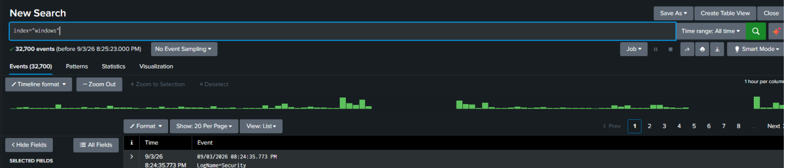
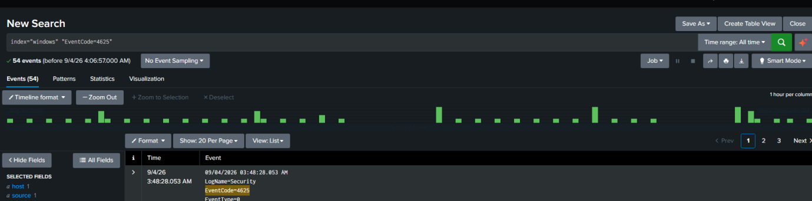
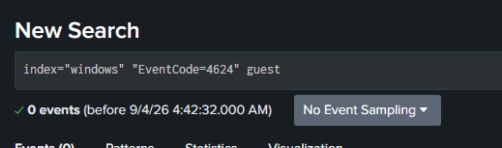
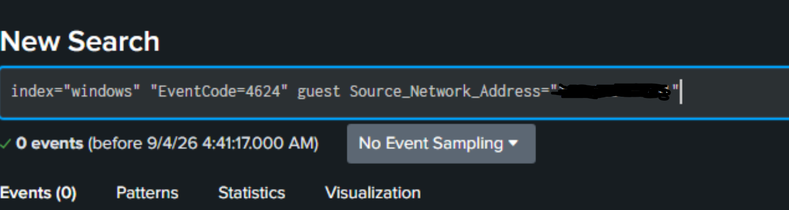
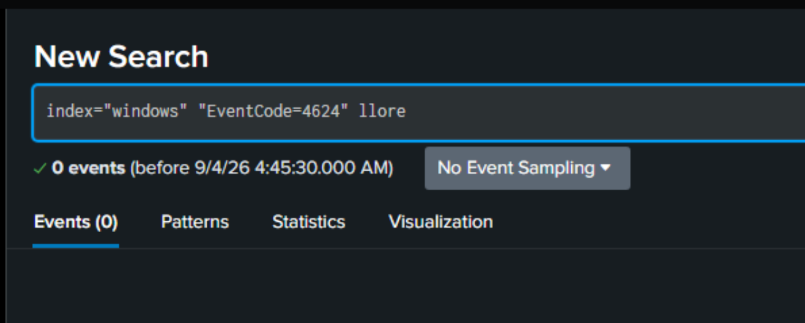
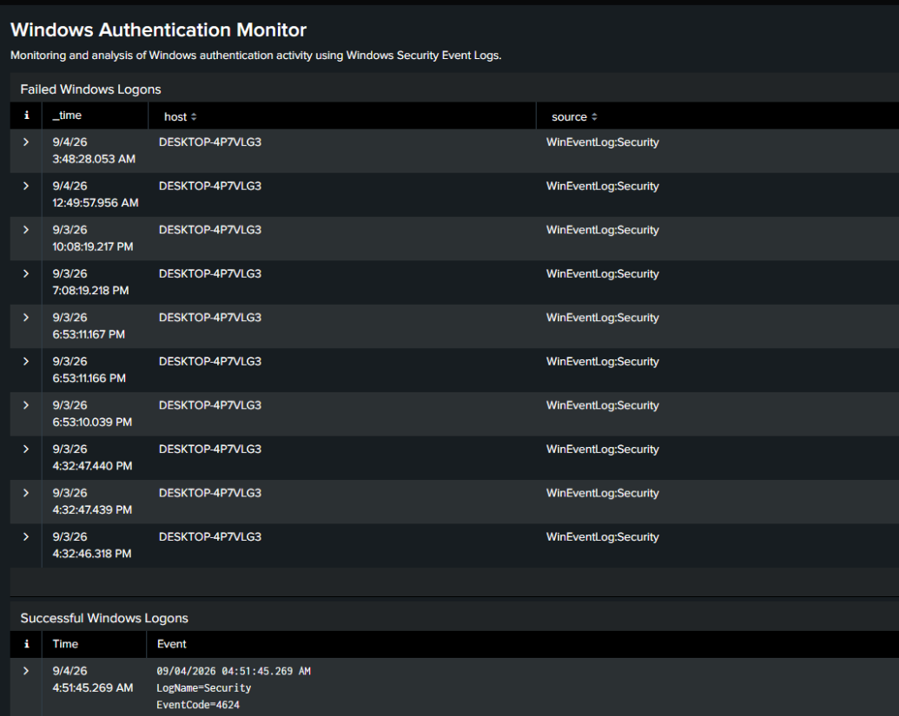

# Lab 01: Windows Authentication Investigation

## Overview

This lab demonstrates the ingestion and analysis of Windows Security Event Logs using Splunk Enterprise.

The goal of this lab was to analyze failed Windows logons in Splunk, identify patterns between the events, check for related successful logons, and create a basic dashboard for monitoring authentication activity.

This lab was completed while studying for the Splunk Core Certified Power User certification.

## Lab Environment

- **SIEM:** Splunk Enterprise
- **Operating System:** Windows
- **Data Source:** Windows Security Event Log
- **Splunk Index:** `windows`
- **Primary Event Codes:**
  - `4625` - Failed logon
  - `4624` - Successful logon
- **Investigation Window:** August 30, 2026 12:00 AM – September 4, 2026 3:00 AM

## Data Ingestion

Windows Security Event Logs were configured as a local data input in Splunk Enterprise and stored in a dedicated `windows` index.

The initial search returned approximately 32,700 Windows Security events.

### SPL

```spl
index="windows"

```



## Failed Authentication Analysis

I searched the Windows Security telemetry for EventCode 4625 to identify failed authentication activity.

### SPL

```spl
index="windows" "EventCode=4625"
```

The search identified 54 failed logon events during the investigation.



During analysis of the events, two primary account patterns were identified:

- `guest`
- `llore`

The events used **Logon Type 3**, indicating network logon activity.

## Guest Account Investigation

Failed network logon attempts targeting the Guest account were associated with a private internal source address.

### Findings

- **Account:** `guest`
- **Source Network Address:** Private internal IP (redacted)
- **EventCode:** `4625`
- **Logon Type:** `3`
- **Failure Reason:** Account currently disabled

All of the Guest logon attempts failed because the account was disabled.



### Successful Authentication Check

I searched for EventCode 4624 activity involving the Guest account and the identified source address.

No corresponding successful network logon was identified within the data reviewed.



## llore Account Investigation

The second pattern I investigated involved failed logons for the `llore` account.

### Findings

- **Account:** `llore`
- **EventCode:** `4625`
- **Logon Type:** `3`
- **Source Network Address:** Not provided in the event
- **Failure Reason:** Unknown username or bad password
- **Host:** `DESKTOP-4P7VLG3`


A search for successful EventCode 4624 authentication activity associated with `llore` returned no matching events within the data reviewed.



## Authentication Monitoring Dashboard

I also created a simple Splunk dashboard that displays failed and successful Windows logon events.

The dashboard contains panels for:

- Failed Windows logons
- Successful Windows logons



## Investigation Conclusion

I investigated authentication activity on my personal Windows device using Windows Security Event Logs ingested into Splunk.

Two failed-logon patterns were identified: network logon attempts targeting a disabled Guest account and failed network logon attempts involving the `llore` account due to an unknown username or bad password.

No successful authentication events associated with either investigated pattern were identified during the period reviewed.

Based on my findings, I would not escalate this activity as a security incident. I did not find any successful logons associated with either failed-logon pattern, and there was no evidence in the logs I reviewed that either account was successfully accessed. I would continue monitoring the activity if the failed attempts continued or other suspicious events appeared.

## Skills Practiced

- Splunk Enterprise
- SPL searching
- Windows Security Event Log analysis
- Field and event exploration
- Authentication investigation
- Boolean search filtering
- Report creation
- Dashboard creation

## Key Takeaways

This lab helped me get more comfortable searching Windows logs in Splunk and using fields to narrow down authentication activity. I also got practice investigating different failed-logon patterns, checking for related successful logons, creating reports, and building a basic dashboard.
